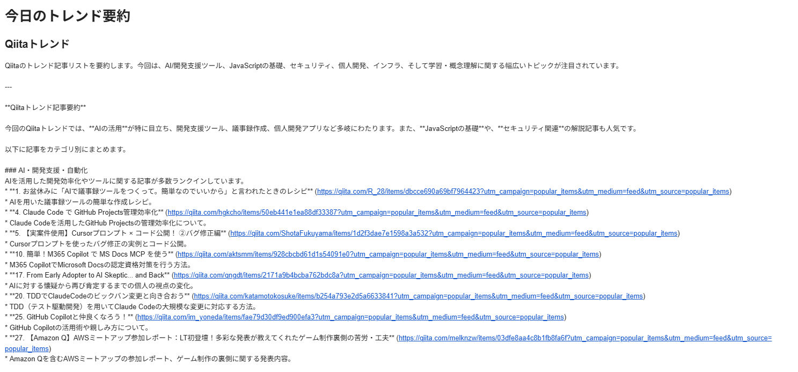

# Daily Trend Summary Mailer

このプロジェクトは、QiitaとZennのトレンド記事を毎日取得し、記事の内容も含めてGoogle Gemini APIで詳細要約し、指定されたメールアドレスに送信するシステムです。

## 機能

- QiitaとZennのトレンド記事をRSSフィードから取得
- **新機能**: 各記事のURLにアクセスして本文内容を取得（上位5件）
- 記事のタイトル、URL、内容を含めてGemini APIで詳細要約
- 要約された内容をGmail SMTP経由でメール送信
- GitHub Actionsによる日次自動実行

## 送信例


## セットアップ

### 1. リポジトリのクローン

```bash
git clone https://github.com/your-username/trend-summary-mailer.git
cd trend-summary-mailer
```

### 2. 依存関係のインストール

Poetryを使用して依存関係を管理します。Poetryがインストールされていない場合は、[公式ドキュメント](https://python-poetry.org/docs/#installation)を参照してインストールしてください。

```bash
poetry install
```

### 3. 環境変数の設定

`.env.template` ファイルをコピーして `.env` ファイルを作成し、必要なAPIキーとメールアドレスを設定します。

```bash
cp .env.template .env
```

`.env` ファイルを以下のように編集してください。

```
QIITA_RSS_URL=https://qiita.com/popular-items/feed
ZENN_RSS_URL=https://zenn.dev/topics/trend/feed
GEMINI_API_KEY=YOUR_GEMINI_API_KEY
GMAIL_APP_PASSWORD=YOUR_GMAIL_APP_PASSWORD
SENDER_EMAIL=your-sender-email@gmail.com
RECEIVER_EMAIL=your-receiver-email@example.com
```

- `QIITA_RSS_URL`: QiitaのトレンドRSSフィードのURL。デフォルトで人気記事のRSSを設定しています。
- `ZENN_RSS_URL`: ZennのトレンドRSSフィードのURL。
- `GEMINI_API_KEY`: Google Gemini APIのキー。 [Google AI Studio](https://aistudio.google.com/app/apikey) で取得できます。
- `GMAIL_APP_PASSWORD`: Gmailアプリパスワード。[Googleアカウント](https://myaccount.google.com/apppasswords)で生成してください。
- `SENDER_EMAIL`: 送信元Gmailアドレス。
- `RECEIVER_EMAIL`: 受信者メールアドレス。

### 4. GitHub Secretsの設定

GitHub Actionsで自動実行するために、以下の環境変数をGitHubリポジトリのSecretsに設定する必要があります。

- `GEMINI_API_KEY`
- `GMAIL_APP_PASSWORD`
- `SENDER_EMAIL`
- `RECEIVER_EMAIL`

リポジトリの `Settings` -> `Secrets and variables` -> `Actions` -> `New repository secret` から追加してください。

## 実行方法

### ローカルでの実行

```bash
poetry run python main.py
```

### GitHub Actionsでの自動実行

リポジトリにプッシュすると、`.github/workflows/daily_summary.yml` に設定されたスケジュール（デフォルトでは毎日UTC 11:00、日本時間午前8時）で自動的に実行されます。手動で実行したい場合は、GitHub Actionsのワークフローページから `Run workflow` をクリックしてください。

## 技術的な詳細

### 記事内容の取得
- BeautifulSoupを使用してQiitaとZennの記事本文をスクレイピング
- レート制限対策として1秒間隔でアクセス
- 各プラットフォームに最適化したコンテンツ抽出
- 上位5件の記事のみ処理してパフォーマンスを最適化

### 要約機能の強化
- 記事タイトルとURLに加えて本文内容も要約に含める
- Gemini API 2.5-flashモデルを使用
- 技術的なポイントと価値のある情報を抽出

## 注意事項

- QiitaのトレンドRSSフィードは公式に提供されていないため、人気記事のRSSを使用しています。より正確なトレンドが必要な場合は、Qiita APIの利用を検討してください。
- Gmailアプリパスワードは通常のパスワードではなく、専用のアプリパスワードを使用してください。
- 記事内容の取得により実行時間が延長されますが、より詳細で有用な要約が生成されます。
